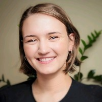

--- 
title: "[Name of Workshop][Year]"
author: "Instructors: [list instructor names here]"
date: "[Insert dates of the workshop]"
site: bookdown::bookdown_site
documentclass: book
bibliography: [book.bib, packages.bib]
url: https://cbw-dev.github.io/bookdown-template/ # [CHANGE THIS LINK TO YOUR LANDING PAGE LINK]
cover-image: img/bioinformatics_logo.png # change this to the CBW icon for your workshop
description: |
  CBW's Bookdown Template for Workshops
link-citations: yes
github-repo: cbw-dev/bookdown-template # change this to your own repo
favicon: img/favicon.ico
---

# (PART) Introduction {-}

# Welcome

<!-- NOTE: Go to the README.md to help understand what to fill in for this workshop template! -->

Welcome to CBW’s [workshop name, year] Workshop!

<!-- This is your index.Rmd file. It is the mandatory landing page for your website. -->

Put some introductory content here. (ex. links to bioinformatics.ca, general info)

<!-- The rest of the content making up the welcome pages are in following files, which begin with "01#-description_of_file" -->

<!--chapter:end:index.Rmd-->

# Course Schedule


**Hello world!**

<!--chapter:end:010-course-schedule.Rmd-->

## Pre-workshop Materials

Click [here](insert link here) for your prework!

<!-- You can insert more here -->

## Computing Setup & Downloads

Insert downloads (ex. datasets) or other tech instructions here (ex. AWS Instructions)

<!--chapter:end:011-content-files.Rmd-->

## Meet Your Faculty

Here's your team!

### Instructor, TA, ...

<!--  insert image here -->

>Job Title <br>
Company/University/... <br>
Location
>
> --- contact information

[insert description of the person]

### Michelle Brazas, PhD

\

>Scientific Director <br>
Canadian Bioinformatics Workshops (CBW) <br>
Toronto, ON, CA
>
> --- support@bioinformatics.ca

Dr. Michelle Brazas is the Associate Director for Adaptive Oncology at the Ontario Institute for
Cancer Research (OICR), and acting Scientific Director at Bioinformatics.ca. Previously, Dr.
Brazas was the Program Manager for Bioinformatics.ca and a faculty member in
Biotechnology at BCIT. Michelle co-founded and runs the Toronto Bioinformatics User Group
(TorBUG) now in its 11th season, and plays an active role in the International Society of
Computational Biology where she sits on the Board of Directors and Executive Board.

### Nia Hughes (she/her)

\

>Program Manager, Bioinformatics.ca
Ontario Institute for Cancer Research
Toronto, ON, Canada
>
> --- nia.hughes@oicr.on.ca

Nia is the Program Manager for Bioinformatics.ca, where she coordinates the Canadian
Bioinformatics Workshop Series. Prior to starting at OICR, she completed her M.Sc. in
Bioinformatics from the University of Guelph in 2020 before working there as a
bioinformatician studying epigenetic and transcriptomic patterns across maize varieties.

## Class Photo

<!--  --> <- Replace the file address to your actual class photo file location


<!--chapter:end:012-meet-your-fac.Rmd-->

# (PART) Modules {-}

# Module 1

Welcome to module 1!

## Lecture

<!-- Insert slideshows as pdfs with this markdown code -->

Here is an example of a pdf embedded:

{width=100% height=900}\ <!-- edit height based your preferences -->

<!-- Try to keep slideshows as pdfs for accessibility, slideshows from google slides can be inserted by pasting in the html code to share it into your markdown -->

Here is an example of a YouTube video embedded:

<iframe width="100%" height=455px src="https://www.youtube.com/embed/WMP_8RTiv40" title="CBW Bridging Pathology and Genomics 2024 | 04.2: Clinical Reporting pt. 2" frameborder="0" allow="accelerometer; autoplay; clipboard-write; encrypted-media; gyroscope; picture-in-picture; web-share" referrerpolicy="strict-origin-when-cross-origin" allowfullscreen></iframe>

### Downloads

[insert your downloads for this module here (ex. datasets)]

## Lab

[Your lab here]

<!-- These pages should be a rendered and compiled version of your code, if you have code.  -->

<!-- R, python, bash and more can run in bookdown.  -->

```{r}
# Your R code here

# For example:
x <- 42
x
```

```{python}
# Your python code here

# For example:
print("hello world")
```

```{bash}
# Your bash code here

# For example:
#pwd
```

<!-- Note, "pwd" is commented out, since it is a bash command, it may cause an error in building for Windows users. -->

Try running these code "chunks" by pressing the green (left-pointing) triangle next to your code chunks. 

You will see the code run in the console and the output provided below the code chunk.

The output of the code will also be produced under the code chunk on your website page.

<!--chapter:end:020-module-1.Rmd-->

# Module 2

## Lecture

## Lab

<!--chapter:end:030-module-2.Rmd-->

